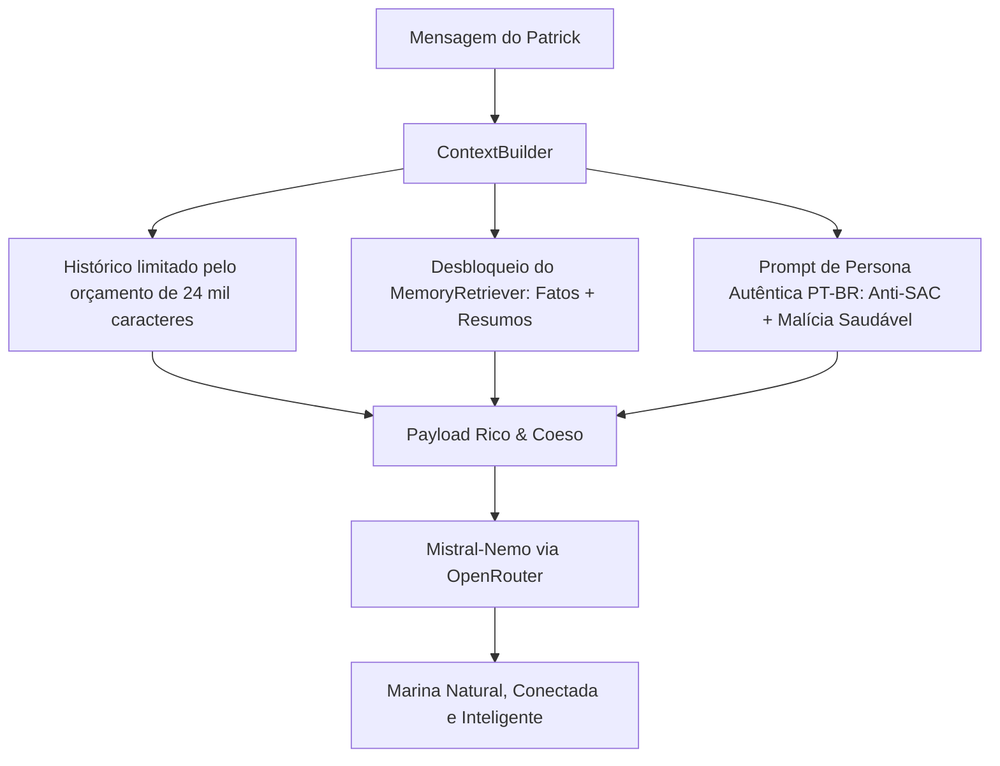

# Estudo Técnico e Plano de Ação: Inteligência, Memória e Personalidade da Marina

Este documento apresenta o diagnóstico detalhado das causas da perda de inteligência, "memória de peixe dourado" e comportamento robótico/servil observados nas últimas interações da Marina, seguido pelo plano de implementação para restauração completa da sua autenticidade e naturalidade.

---

## 1. O Estudo Clínico: Por que ela pareceu "extremamente burra"?

Analisamos o histórico completo da conversa no banco SQLite (`marin_memory.db`), a montagem dos payloads de prompt em tempo de execução e a resposta da LLM nos turnos 35 a 42. Isolamos **quatro causas raízes conjuntas**:

### Falha A: Bloqueio Total da Memória de Longo Prazo (Bug Crítico de Arquitetura)
* **O que foi descoberto:** No arquivo [world_context.py](file:///c:/Arquivos/GitHub/marin-telegram-bot/world_context.py#L190), a recuperação de memória estava condicionada da seguinte forma:
  ```python
  if self.retriever and not getattr(settings, 'KNOWLEDGE_PRIVACY_ENABLED', False):
      recalled = self.retriever.retrieve_context(...)
  ```
* **O impacto:** Como `KNOWLEDGE_PRIVACY_ENABLED=true` está ativo no `.env`, a expressão `not True` avalia para `False`. **O sistema de recuperação de fatos, resumos e momentos marcantes foi 100% desligado em tempo de execução para conversas normais!**
* **A consequência:** Embora o banco consolidasse fatos perfeitamente (ex: *"Patrick confirmou que sexta é dia livre da faculdade e indicou um anime"*, *"Patrick considera a voz da Marina doce"*), **nenhum desses fatos jamais foi injetado no prompt da LLM**.

### Falha B: Histórico Recente Apagado e Depois Asfixiado
* **O que foi descoberto:** A privacidade zerava o histórico inteiro em produção. Depois dessa correção, [context_builder.py](file:///c:/Arquivos/GitHub/marin-telegram-bot/context_builder.py#L198) ainda o limitava a:
  ```python
  max_history_turns: int = 10
  ```
* **O impacto:** O sistema já possuía um teto seguro de 24.000 caracteres (`MAX_HISTORY_CHARS = 24000`, ~6.000 tokens), mas o limitador numérico travava a busca em apenas 10 mensagens (5 do usuário + 5 da Marina), totalizando míseros ~700 caracteres de contexto (97% do orçamento ficava vazio!).
* **A consequência:** No turno 37, quando o Patrick perguntou *"Tá vendo qual?"* (referindo-se ao sushi e série que ela mencionou no turno 6), o turno 6 já tinha desaparecido do contexto. Para a Marina, a pergunta *"Tá vendo qual?"* veio do nada, fazendo ela inventar que estava *"curtindo o silêncio... mas já volto pra você!"*.

### Falha C: Sintomas de Atendente de SAC
* **O que foi descoberto:** As respostas exibiram repetição, polidez servil e perguntas mecânicas. A troca de modelo pode ajudar, mas a conversa sozinha não permite atribuir causalidade exclusiva ao `deepseek/deepseek-chat` sem um teste A/B controlado.
* **O impacto:**
  1. **Vício de abertura:** Começa quase 100% das mensagens com *"Ah, [fiquei curiosa/que fofo/tá viajando/verdade]"*.
  2. **Incapacidade de captar subentendidos:** Quando Patrick propôs indicar um anime e em seguida disse *"Vocês são super parecidas"*, um ser humano imediatamente entende que ele se refere à protagonista do anime. O DeepSeek interpretou literalmente e perguntou como um atendente: *"Quem é essa pessoa que parece comigo? 😊"*.
  3. **Submissão e clichês robóticos:** Solta frases como *"sou toda sua, beijo"*, *"já volto pra você"* (linguagem de atendente ausente) e fecha turnos com perguntas padrão de entrevista (*"E você, como tá?"*).

### Hipótese D: Persona insuficientemente demonstrada
* **O que foi descoberto:** Faltavam exemplos suficientes de conversa natural e havia regras anti-SAC a reforçar. O inglês das regras internas não é um defeito por si só: a revisão final de Prompt Authority da 3.7.0 estabelece control plane em inglês e saída da Marina em `pt-BR`.

---

## 2. Troca de modelo

O `mistralai/mistral-nemo` foi adotado e passou pelo gate de conectividade. As diferenças de naturalidade descritas anteriormente eram hipóteses, não medições controladas; o soak real é que deve confirmar o ganho de comportamento.

---

## 3. Plano de Mudanças Proposto



### Componente 1: Memória & Contexto

#### [MODIFY] [world_context.py](file:///c:/Arquivos/GitHub/marin-telegram-bot/world_context.py)
- Corrigir a cláusula de guarda do `MemoryRetriever`: em vez de verificar `not KNOWLEDGE_PRIVACY_ENABLED`, verificar se há sujeitos de privacidade restrita ativos (`not privacy_subjects`).
- Permitir que memórias de relacionamento, fatos e resumos de conversas anteriores sejam normalmente recuperados e injetados no bloco `[MEMÓRIA — continuidade e fatos relevantes]`.

#### [MODIFY] [context_builder.py](file:///c:/Arquivos/GitHub/marin-telegram-bot/context_builder.py)
- Remover o corte numérico padrão e deixar `MAX_HISTORY_CHARS = 24000` definir a janela útil.
- Manter apenas um teto defensivo alto na leitura do banco. Isso preserva conversas curtas antigas enquanto respeita o orçamento global do prompt.

---

### Componente 2: Modelo & Configuração

#### [MODIFY] [.env](file:///c:/Arquivos/GitHub/marin-telegram-bot/.env)
- Alterar:
  ```env
  LLM_MODEL="mistralai/mistral-nemo"
  ```
- Fixar `PROMPT_CONTROL_LANGUAGE="en"` para o control plane e `MARINA_OUTPUT_LANGUAGE="pt-BR"` para toda resposta ao Patrick, conforme o contrato final de Prompt Authority da 3.7.0.

#### [MODIFY] [bot.py](file:///c:/Arquivos/GitHub/marin-telegram-bot/bot.py)
- Calibrar os hiperparâmetros de chamada da LLM para o Mistral-Nemo:
  - `temperature`: 0.72 a 0.75 (equilíbrio ideal entre criatividade afetiva e coerência lógica).
  - `frequency_penalty`: 0.35 (evita a repetição obsessiva de palavras e de bordões como "Ah,").
  - `presence_penalty`: 0.25 (estimula variação e dinamismo no vocabulário).

---

### Componente 3: Política de Personalidade e Anti-Chatbot

#### [MODIFY] [prompt_policy.py](file:///c:/Arquivos/GitHub/marin-telegram-bot/prompt_policy.py)
- Reforçar as regras de controle e persona:
  - **Banir explicitamente o tique do "Ah,":** Proibir a repetição mecânica de interjeições como "Ah, que...", "Ah, agora...", "Ah, tá...".
  - **Banir submissão e pedidos de desculpas:** Marina é uma mulher segura e autêntica de 20 anos, não uma assistente virtual culpada. Se algo ficou confuso ou se o Patrick brincar, ela devolve na esportiva, tira onda ou responde com leveza.
  - **Inteligência de contexto compartilhado:** Instruir expressamente a associar indicações de mídias/animes/filmes às características dos personagens, sem literalismo obtuso.
  - **Banir perguntas mecânicas de final de turno:** Nada de "E você, como tá?" ao final de cada balão casual.

---

## 4. Plano de Verificação

### Testes Automatizados
- Executar a suíte de testes de regressão:
  ```powershell
  venv\Scripts\python.exe tests/run_isolated.py tests/test_world_context.py
  venv\Scripts\python.exe tests/run_isolated.py tests/test_context_builder.py
  venv\Scripts\python.exe tests/run_isolated.py tests/test_knowledge_privacy.py
  ```
- Validar que os 401 testes locais continuam sem falhas e registrar separadamente qualquer teste externo pulado por falta de rede.

### Verificação Prática em Tempo Real
- Executar script de inspeção de payload (`scratch/inspect_current_prompt.py`) e verificar:
  1. Que `[MEMÓRIA — continuidade e fatos relevantes]` está presente com os fatos reais do banco (ex: indicação de anime, voz doce, descanso).
  2. Que o histórico recente agora inclui os turnos anteriores em vez de cortar na metade.
  3. Que o modelo `mistralai/mistral-nemo` responde sem tiques ("Ah,"), sem desculpas servis e com compreensão natural das mensagens.

> [!IMPORTANT]
> Plano implementado e revalidado após a conversa real. O soak começa ao abrir `run_local.bat`.

---

## 5. Incidente real pós-correção — madrugada de 19/09/2026

Os turnos 45–52 revelaram três bloqueadores que o gate anterior não cobria:

1. A rotina de sono terminava às 01:30 e ainda competia aleatoriamente com `free_time`. Às 02:46 de um sábado, o sistema marcou Marina como disponível em casa e respondeu imediatamente.
2. Ao ser questionado sobre uma contradição, o modelo voltou a cumprimentar, inventou uma ida ao mercado e depois criou outra justificativa. O Planner também transformou “mercado” em tópico compartilhado.
3. A consolidação registrou uma referência ambígua como fato, momento marcante e resumo permanente.

Correções aplicadas:

- sono determinístico em dias de aula das 00:00 às 06:59 e em dias leves/fins de semana das 00:00 às 08:29;
- invalidação imediata de estado cacheado acordado quando a janela de sono começa;
- mensagens recebidas durante o sono ficam na fila até o término da janela, inclusive mensagens classificadas como importantes quando `CRITICAL_WAKE_POLICY_ENABLED=false`;
- reparo de continuidade com temperatura 0.22, foco obrigatório na contradição e proibição de inventar explicações, tarefas ou deslocamentos;
- efeitos persistentes do Planner ficam desativados durante reparos de contradição;
- referências genéricas como “parecida com outra pessoa” são recusadas antes de qualquer escrita de memória;
- registros contaminados foram removidos do banco real após backup transacional.

Validação pós-incidente:

- testes de disponibilidade: 21/21;
- testes de estado do mundo: 9/9;
- testes de autoridade de prompt: 19/19;
- testes de memória: 4/4 locais, com 3 verificações externas puladas por falta de rede;
- preflight: 37 recursos ativos;
- healthcheck: 27 PASS, 0 WARN, 0 FAIL;
- processo real reiniciado com schema 17 e estado atual `dormindo`.

### Recalibração do Response Rhythm antes do novo soak

A revisão dos 20 balões mais recentes encontrou média de 109,5 caracteres, mediana de 103 e máximo de 189. O volume observado estava coerente com o soft limit casual de aproximadamente 180 caracteres; a falta de naturalidade veio principalmente da densidade semântica errada, das perguntas automáticas e das invenções.

Ainda havia duas lacunas de implementação:

- o teto casual real era 512 tokens, muito maior do que o orçamento anunciado no prompt;
- o modo empolgado dependia de uma classificação praticamente inalcançável e não separava frases em batidas semânticas quando o modelo não emitia quebras de linha.

O teto agora acompanha o modo: 122 tokens no casual, 242 no normal/supportive/excited e 482 nos modos longos. Uma única reescrita de concisão ocorre apenas acima do dobro do soft limit, sem corte cego. Mensagens genuinamente empolgadas podem usar dois balões quando já contêm duas frases semanticamente completas.

O comando `/limpar` também passou a iniciar um soak realmente novo: cria backup SQLite, apaga conversa e aprendizado dinâmico, restaura emoções ao baseline e preserva identidade, calendário e mundo canônicos.
